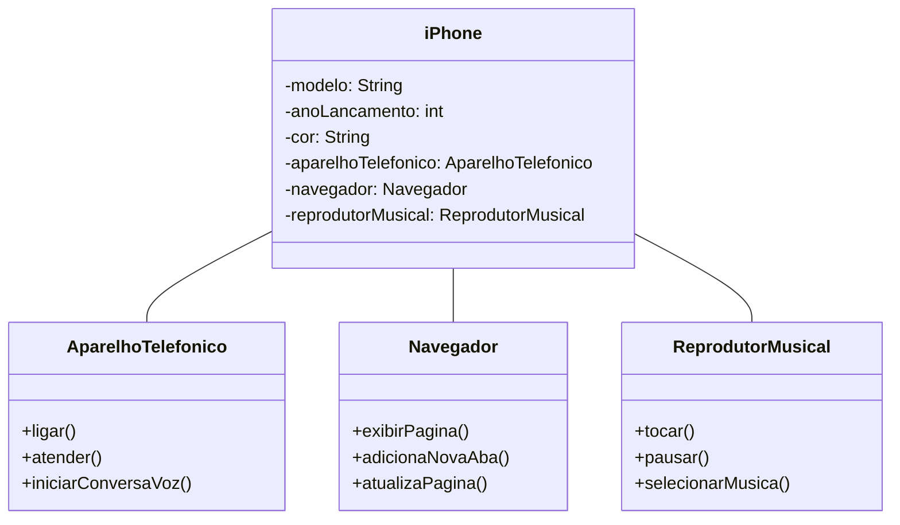

# Desafio Diagrama UML
Projetos desenvolvidos com base nos estudos do Boocamp Santander/DIO

```mermaid
classDiagram
    class iPhone {
        -modelo: String
        -anoLancamento: int
        -cor: String
        -aparelhoTelefonico: AparelhoTelefonico
        -navegador: Navegador
        -reprodutorMusical: ReprodutorMusical
    }

    class AparelhoTelefonico {
        +ligar()
        +atender()
        +iniciarConversaVoz()
    }

    class Navegador {
        +exibirPagina()
        +adicionaNovaAba()
        +atualizaPagina()
    }

    class ReprodutorMusical {
        +tocar()
        +pausar()
        +selecionarMusica()
    }

    iPhone -- AparelhoTelefonico
    iPhone -- Navegador
    iPhone -- ReprodutorMusical
```
